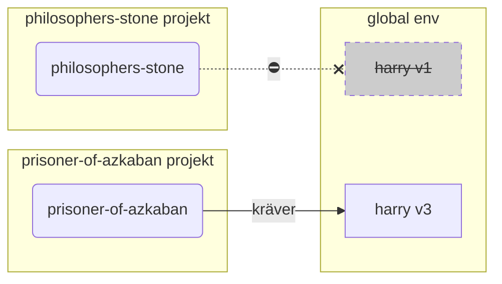

# Virtuella miljöer

När du arbetar med Python-projekt bör du förmodligen använda en **virtuell miljö** (eller en liknande mekanism) för att isolera de paket du installerar för varje projekt.

/// info

Om du redan känner till virtuella miljöer, hur man skapar dem och använder dem, kanske du vill hoppa över den här sektionen. 🤓

///

/// tips

En **virtuell miljö** är annorlunda än en **miljövariabel**.

En **miljövariabel** är en variabel i systemet som kan användas av program.

En **virtuell miljö** är en katalog med några filer i.

///

/// info

Den här sidan kommer att lära dig hur man använder **virtuella miljöer** och hur de fungerar.

Om du är redo att anta ett **verktyg som hanterar allt** för dig (inklusive installation av Python), prova <a href="https://github.com/astral-sh/uv" class="external-link" target="_blank">uv</a>.

///

## Skapa ett projekt

Först, skapa en katalog för ditt projekt.

Det jag vanligtvis gör är att jag skapar en katalog Here is the translated text to Swedish:

```markdown
programmet som kallas `python`
* `-m`: kalla ett modul som ett skript, vi kommer att berätta vilken modul nästa
* `venv`: använd modulen som kallas `venv` som normalt kommer installerad med Python
* `.venv`: skapa den virtuella miljön i den nya katalogen `.venv`

///

////

//// tab | `uv`

Om du har <a href="https://github.com/astral-sh/uv" class="external-link" target="_blank">`uv`</a> installerad, kan du använda den för att skapa en virtuell miljö.

<div class="termy">

```console
$ uv venv
```

</div>

/// tips

Som standard kommer `uv` att skapa en virtuell miljö i en katalog som kallas `.venv`.

Men du kan anpassa det genom att skicka ett ytterligare argument med katalognamnet.

///

////

Detta kommando skapar en ny virtuell miljö i en katalog som kallas `.venv`.

/// detaljer | `.venv` eller annat namn

Du kan skapa den virtuella miljön i en annan katalog, men det finns en konvention om att kalla den `.venv`.

///

## Aktivera den virtuella miljön

Aktivera
``` Här är översättningen till svenska:

att kunna installeras globalt, förmodligen med en annan version än vad du behöver.

/// 

## Kontrollera att den virtuella miljön är aktiv

Kontrollera att den virtuella miljön är aktiv (det tidigare kommandot fungerade).

/// tips

Detta är **valfritt**, men det är ett bra sätt att **kontrollera** att allt fungerar som förväntat och att du använder den virtuella miljön som du avsåg.

///

//// flik | Linux, macOS, Windows Bash

<div class="termy">

```console
$ which python

/home/user/code/awesome-project/.venv/bin/python
```

</div>

Om det visar den `python` binärfilen på `.venv/bin/python`, inuti ditt projekt (i det här fallet `awesome-project`), då fungerade det. 🎉

////

//// flik | Windows PowerShell

<div class="termy">

```console
$ Get-Command python

C:\Users\user\code\awesome-project\.venv\Scripts\python
```

</div>

Om det visar den `python` binärfilen på `.venv\Scripts\python`, inuti ditt projekt (i det här fallet `awesome-project`), då fungerade det. Here is the translated text to Swedish:

ank">`uv`</a> för att skapa den virtuella miljön, det gjordes redan för dig, så du kan hoppa över det här steget. 😎

///

/// tips

Gör detta **en gång**, direkt efter att du har skapat den virtuella miljön.

/// 

<div class="termy">

```console
$ echo "*" > .venv/.gitignore
```

</div>

/// detaljer | Vad kommandot betyder

* `echo "*"`: kommer att "skriva ut" texten `*` i terminalen (den nästa delen ändrar detta något)
* `>`: allt som skrivs ut till terminalen av kommandot till vänster om `>` ska inte skrivas ut, utan istället skrivas till filen som går till höger om `>`
* `.gitignore`: namnet på filen där texten ska skrivas

Och `*` för Git betyder "allt". Så, det kommer att ignorera allt i katalogen `.venv`.

Det kommandot kommer att skapa en fil `.gitignore` med innehållet:

```gitignore
*
```

///

## Installera paket

Efter att ha aktiverat miljön kan du installera paket i den.

/// tips

Gör detta **en gång** när du installerar eller uppgraderar den Here is the translation of the provided text into Swedish:

```
l -r requirements.txt
---> 100%
```

</div>

////

//// tab | `uv`

Om du har <a href="https://github.com/astral-sh/uv" class="external-link" target="_blank">`uv`</a>:

<div class="termy">

```console
$ uv pip install -r requirements.txt
---> 100%
```

</div>

////

/// detaljer | `requirements.txt`

En `requirements.txt` med några paket kan se ut så här:

```requirements.txt
fastapi[standard]==0.113.0
pydantic==2.8.0
```

///

## Kör ditt program

Efter att du har aktiverat den virtuella miljön kan du köra ditt program, och det kommer att använda Python inuti din virtuella miljö med de paket du installerade där.

<div class="termy">

```console
$ python main.py

Hello World
```

</div>

## Konfigurera din editor

Du skulle sannolikt använda en editor, se till att du konfigurerar den till att använda samma virtuella miljö som du skapade (den kommer förmodligen att autodetektera den) så att du kan få autocompletion och inline-fel.

Till exempel:

* <a Here is the translation of your text into Swedish:

```swedish
ss="external-link" target="_blank">Python</a>.

Efter det behöver du **installera** FastAPI och andra **paket** som du vill använda.

För att installera paket skulle du normalt använda `pip`-kommandot som följer med Python (eller liknande alternativ).

Men om du bara använder `pip` direkt skulle paketen installeras i din **globala Python-miljö** (den globala installationen av Python).

### Problemet

Så, vad är problemet med att installera paket i den globala Python-miljön?

Vid något tillfälle kommer du förmodligen att skriva många olika program som beror på **olika paket**. Och några av dessa projekt du arbetar med kommer att bero på **olika versioner** av samma paket. 😱

Till exempel kan du skapa ett projekt som heter `philosophers-stone`, detta program beror på ett annat paket som heter **`harry`, som använder version `1`**. Så, du behöver installera `harry`.

```mermaid
flowchart LR
stone(philosophers-stone) -->|kräver| 
``` För att köra `prisoner-of-azkaban` behöver du avinstallera `harry` version `1` och installera `harry` version `3` (eller så skulle enbart installation av version `3` automatiskt avinstallera version `1`).

<div class="termy">

```console
$ pip install "harry==3"
```

</div>

Och då skulle du ha `harry` version `3` installerad i din globala Python-miljö.

Och om du försöker köra `philosophers-stone` igen, finns det en chans att det **inte fungerar** eftersom det behöver `harry` version `1`.



/// tips

Det är mycket vanligt i Python-paket att försöka undvika **brytande förändringar** i **nya versioner**, men... De paket du installerar.

När du kör:

<div class="termy">

```console
// Kör inte detta nu, det är bara ett exempel 🤓
$ pip install "fastapi[standard]"
---> 100%
```

</div>

Det kommer att ladda ner en komprimerad fil med FastAPI-koden, vanligtvis från <a href="https://pypi.org/project/fastapi/" class="external-link" target="_blank">PyPI</a>.

Det kommer också att **ladda ner** filer för andra paket som FastAPI är beroende av.

Sedan kommer det att **extrahera** alla dessa filer och placera dem i en katalog på din dator.

Som standard kommer det att placera de nedladdade och extraherade filerna i katalogen som följer med din Python-installation, det är den **globala miljön**.

## Vad är virtuella miljöer

Lösningen på problemen med att ha alla paket i den globala miljön är att använda en **virtuell miljö för varje projekt** du arbetar med.

En virtuell miljö är en **katalog**, mycket liknande den globala, där du kan installera paketen för ett. Here is the translated text in Swedish:

Bash</a>):

<div class="termy">

```console
$ source .venv/Scripts/activate
```

</div>

////

Det kommandot kommer att skapa eller ändra några [miljövariabler](environment-variables.md){.internal-link target=_blank} som kommer att vara tillgängliga för de nästa kommandona.

En av dessa variabler är `PATH`-variabeln.

/// tips

Du kan lära dig mer om `PATH`-miljövariabeln i avsnittet [Miljövariabler](environment-variables.md#path-environment-variable){.internal-link target=_blank}.

///

Att aktivera en virtuell miljö lägger till dess sökväg `.venv/bin` (på Linux och macOS) eller `.venv\Scripts` (på Windows) till `PATH`-miljövariabeln.

Låt oss säga att innan vi aktiverade miljön, såg `PATH`-variabeln ut så här:

//// tab | Linux, macOS

```plaintext
/usr/bin:/bin:/usr/sbin:/sbin
```

Det betyder att systemet skulle leta efter program i:

* `/usr/bin`
* `/bin`
* `/usr/sbin`
* `/sbin`

////

//// tab | Sure! Here is the text translated into Swedish:

```
innan du tittar i de andra katalogerna.

Så när du skriver `python` i terminalen kommer systemet att hitta Python-programmet i

```plaintext
C:\Users\user\code\awesome-project\.venv\Scripts\python
```

och använda den.

////

En viktig detalj är att den kommer att sätta sökvägen till den virtuella miljön i **början** av `PATH`-variabeln. Systemet kommer att hitta den **före** att det hittar någon annan tillgänglig Python. På så sätt, när du kör `python`, kommer det att använda Python **från den virtuella miljön** istället för någon annan `python` (till exempel en `python` från en global miljö).

Att aktivera en virtuell miljö ändrar också ett par andra saker, men detta är en av de viktigaste sakerna som det gör.

## Kontrollera en Virtuell Miljö

När du kontrollerar om en virtuell miljö är aktiv, till exempel med:

//// tab | Linux, macOS, Windows Bash

<div class="termy">

```console
$ which
``` Here is the translation of the provided text to Swedish:

---

**kunde inte köras** eftersom du använder **inkorrekt Python**, från en virtuell miljö för ett annat projekt.

Det är användbart att kunna kontrollera vilken `python` som används. 🤓

///

## Varför Avaktivera en Virtuell Miljö

Till exempel, du kan arbeta på ett projekt `filosofens-sten`, **aktivera den virtuella miljön**, installera paket och arbeta med den miljön.

Och sedan vill du arbeta på **ett annat projekt** `fången-från-azkaban`.

Du går till det projektet:

<div class="termy">

```console
$ cd ~/kod/fången-från-azkaban
```

</div>

Om du inte avaktiverar den virtuella miljön för `filosofens-sten`, när du kör `python` i terminalen kommer den att försöka använda Python från `filosofens-sten`.

<div class="termy">

```console
$ cd ~/kod/fången-från-azkaban

$ python main.py

// Fel vid import av sirius, det är inte installerat 😱
Traceback (most recent call last):
File "main.py", line 1, in <module>
import sirius
```

</div>

Men 

--- 

Please let me know if you need any further assistance! Here is the translated text in Swedish:

tendenser, virtuella miljöer, etc. Jag skulle föreslå att du provar <a href="https://github.com/astral-sh/uv" class="external-link" target="_blank">uv</a>.

`uv` kan göra många saker, det kan:

* **Installera Python** för dig, inklusive olika versioner
* Hantera **den virtuella miljön** för dina projekt
* Installera **paket**
* Hantera paketens **beroenden och versioner** för ditt projekt
* Se till att du har en **exakt** uppsättning av paket och versioner att installera, inklusive deras beroenden, så att du kan vara säker på att du kan köra ditt projekt i produktion precis samma som på din dator under utveckling, detta kallas **låsa**
* Och många andra saker

## Slutsats

Om du har läst och förstått allt detta, så **vet du mycket mer** om virtuella miljöer än många utvecklare där ute. 🤓

Att känna till dessa detaljer kommer sannolikt att vara användbart i framtiden när du felsöker något som verkar komplext, men du kommer att veta **hur allt fungerar under ytan**.
